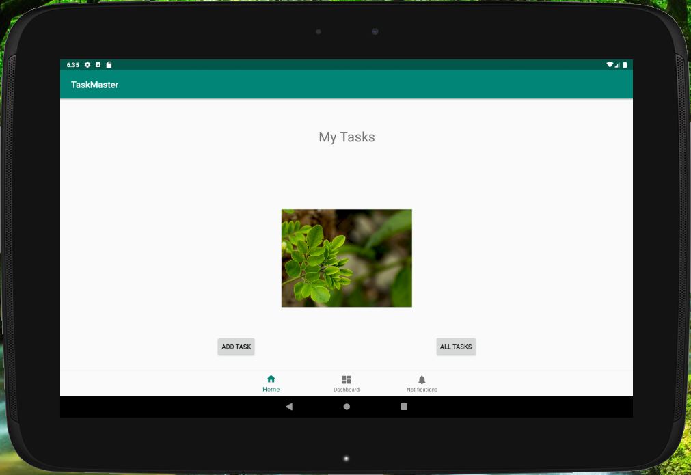
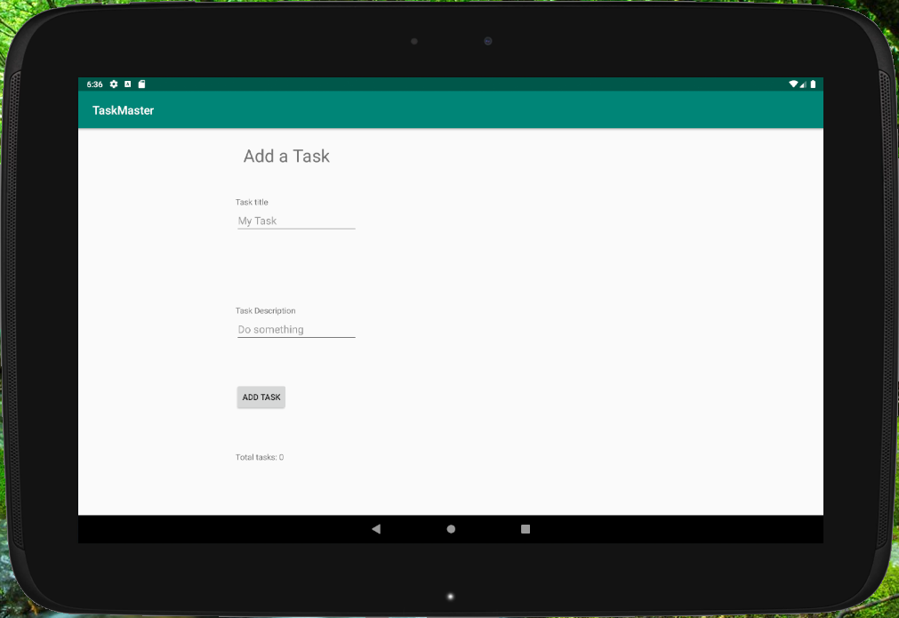
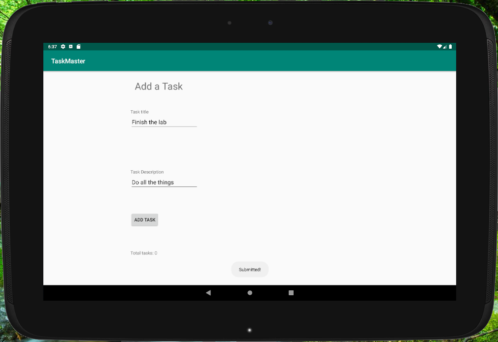
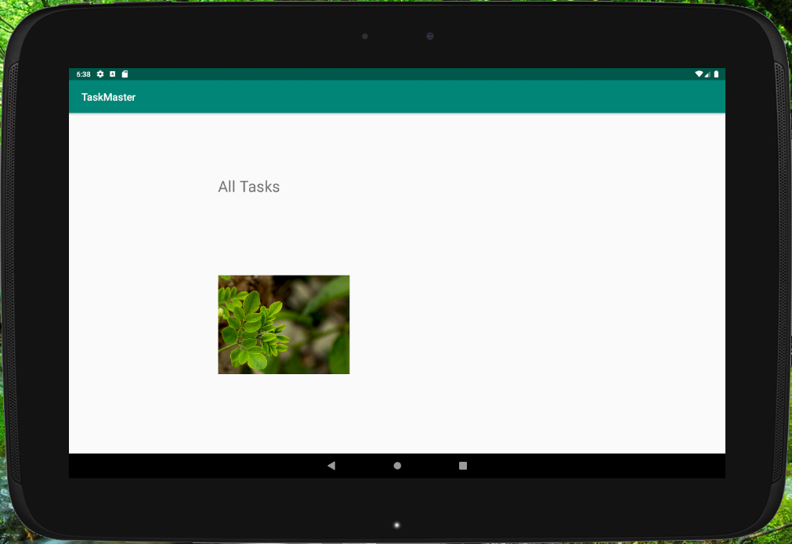

# TaskMaster Android App

## Description
We are building a TaskMaster App!

## Change Log
### Monday
* Build main page to match [wireframe](https://codefellows.github.io/code-401-java-guide/curriculum/class-26/taskmaster_homepage.png)
* Include heading at top of page, an image placeholder for the "my tasks" view, and buttons at the bottom to route to "add tasks" and "all tasks" pages
* [Build "Add a Task" page](https://codefellows.github.io/code-401-java-guide/curriculum/class-26/taskmaster_add_task.png)
* Include allowing users to type in details about a new task (title and body).
* Include a displayed "submitted!" label on the page when the user clicks the "submit" button
* [Build the "All Tasks" page](https://codefellows.github.io/code-401-java-guide/curriculum/class-26/taskmaster_all_tasks.png)
* Include an image with a back button - no functionality needed at this point
* Create directory called screenshots
* Build unit tests for any testable code at this point
* Stretch goal: Consider the styling for this app. Decide on a color scheme and font families to use.
#### Screenshots
  
  
  
  

### Tuesday
* Create a Settings page. It should allow users to enter their username and hit save.
* Modify the main page to contain three different buttons with hardcoded task titles. 
* When a user taps one of the titles, it should go to the Task Detail page, and the title at the top of the page should match the task title that was tapped on the previous page.
* The homepage should also contain a button to visit the Settings page, and once the user has entered their username, it should display “{username}’s tasks” above the three task buttons.
* Update homepage screenshot and add a screenshot of Task Detail page.
* Build unit tests for any testable code at this point
* Stretch goal: Allow the user to specify on their settings page how many tasks should be shown on the homepage. Use this to dynamically create buttons for as many tasks as the user requests.
#### Screenshots

### Wednesday
* Refactor homepage with a RecyclerView holding Task data
* Create a task class. A task should include a title, body, and a state. The state should be one of "new", "assigned", "in progress", or "complete".
* Create a ViewAdapter class that displays data from a list of Tasks.
* In MainActiviy, create at least three hardcoded Task instances and use those to populate RecyclerView/ViewAdapter
* Ensure that clicking any task in the RecyclerView appropriately launches the detail page with the correct title.
* Update homepage screenshot
* Create Espresso tests
* Stretch goal: Allow the user to specify on their settings page how many tasks should be shown on the homepage. Use this to dynamically create as many tasks as the user requests for display in the RecyclerView.
* Stretch goal: Display the description of the correct task instead of the Lorem Ipsum text on the task detail page.
#### Screenshots

### Thursday
#### Screenshots

### Friday
#### Screenshots

## Resources 
* [Android Buttons](https://developer.android.com/guide/topics/ui/controls/button.html)
* [Android UI Events](https://developer.android.com/guide/topics/ui/ui-events.html)
* [Android Studio user guide](https://developer.android.com/studio/intro)
* [Android SharedPreferences](https://developer.android.com/training/data-storage/shared-preferences)
* [The Activity Lifecycle](https://developer.android.com/guide/components/activities/activity-lifecycle)
* [RecyclerView](https://developer.android.com/guide/topics/ui/layout/recyclerview#java)
* []
